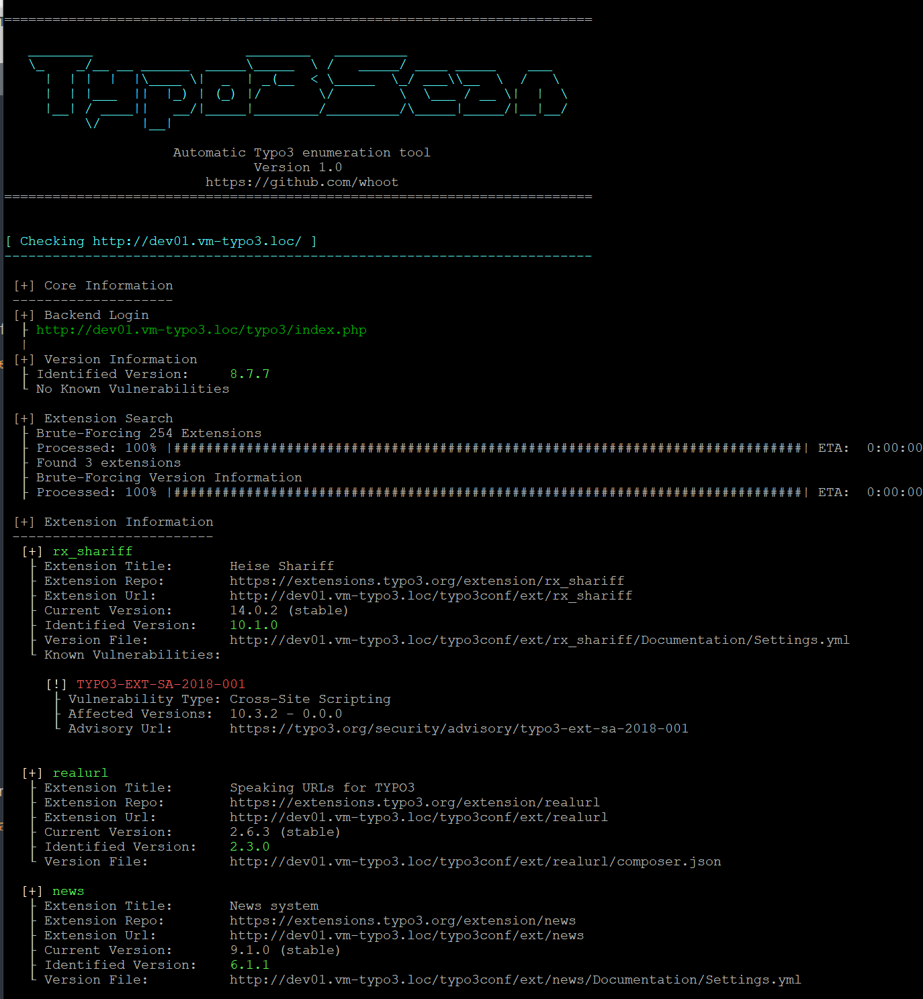

# UNSUPPORTED
Version 1.2 is the final release of Typo3Scan. This software will not get any updates.

Since my initial release a lot changed in Typo3, but especially in version 12 onwards and with composer installations.
It is not possible anymore to enumerate the Typo3 version and installed extensions (seems like they moved everything to the *vendor/* path, which is forbidden to access) and therefore Typo3Scan is useless for these installations.

# Typo3Scan

Typo3Scan is an open source penetration testing tool that I wrote to automate the process of detecting the [Typo3 CMS](https://typo3.org) version and its installed [extensions](https://extensions.typo3.org/).\
Useful parts of the official [security advisories](https://typo3.org/help/security-advisories) are stored in a database and compared with the identified versions. If vulnerabilities are known for the version in use, the corresponding advisory is displayed.

Typo3Scan does not exploit vulnerabilities! Its soley purpose was to enumerate version info and installed extensions in penetration tests ever since.

**Disclaimer**\
Typo3Scan is intended to be used for legal security purposes only, and you should only use it to test websites you own or have permission to test. Any other use is not the responsibility of the developer(s). Be sure that you understand and are complying with the laws in your area. In other words, don't be stupid, don't be an asshole, and use this tool responsibly and legally.

## A note on Extensions

While detecting a Typo3 core version is quite simple, it is not for extensions.\
**Reliably** determining the extension version is **not possible**, because of the following issues:

1. Extensions are basically just PHP files. Since it is (obviously) not possible to download a PHP file, it can't be used for version detection. Therefore you have to use other files like changelogs, setting files and so on. However, Typo3 restricts access to most of them by default.
2. Version information is not consistent. Developers do what they want. Some use a date, some actual version numbers, some may even just add a short text and some don't track versions at all. It's a mess.
3. Extension developers tend to not update version numbers or descriptions on each update. Even if you identified a version string, this does not mean that it is the version actually in use. Most likely it hasn't been updated for a long time.

My solution to this was: download all extensions and get a list of common files which _could_ include version information. If such a files exists for an extension, a generic regex is used to search for version info.

**This will produce false positives!\
You have to check found extensions manually by downloading them from the [official extension repo](https://extensions.typo3.org/) and check the files!**

  
## Installation

You can download the latest tarball by clicking [here](https://github.com/whoot/Typo3Scan/tarball/master) or latest zipball by clicking  [here](https://github.com/whoot/Typo3Scan/zipball/master).

Preferably, you can download Typo3Scan by cloning the repository:

    git clone https://github.com/whoot/Typo3Scan.git

Typo3Scan works with [Python 3](http://www.python.org/download/) version **>= 3.7** on Debian/Ubuntu and Windows platforms.

You can install all required packages with pip3:

	python3 -m venv ./venv
	source ./venv/bin/activate
	pip3 install -r requirements.txt

## Usage

To get a list of all options use:

    python3 typo3scan.py -h

Example:

    python3 typo3scan.py -d http://dev01.vm-typo3.loc/ --vuln

## Bug Reporting / Support

Bug reports are welcome! Please report all bugs on the [issue tracker](https://github.com/whoot/Typo3Scan/issues).

I´m developing this in my spare time. If you like my work, please consider supporting my coffee consume:

## Links

* Download: [.tar.gz](https://github.com/whoot/Typo3Scan/tarball/master) or [.zip](https://github.com/whoot/Typo3Scan/archive/master.zip)
* Changelog: [Here](https://github.com/whoot/Typo3Scan/blob/master/doc/CHANGELOG.md)
* Issue tracker: [Here](https://github.com/whoot/Typo3Scan/issues)

# License

Typo3Scan - Automatic Typo3 Enumeration Tool

Copyright (c) 2015-2023 Jan Rude

This program is free software: you can redistribute it and/or modify
it under the terms of the GNU General Public License as published by
the Free Software Foundation, either version 3 of the License, or
(at your option) any later version.

This program is distributed in the hope that it will be useful,
but WITHOUT ANY WARRANTY; without even the implied warranty of
MERCHANTABILITY or FITNESS FOR A PARTICULAR PURPOSE.  See the
GNU General Public License for more details.

You should have received a copy of the GNU General Public License
along with this program. If not, see [http://www.gnu.org/licenses/](http://www.gnu.org/licenses/)
